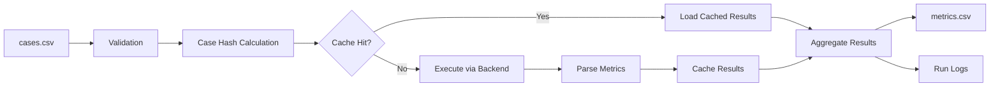

# Strataregula DOE Runner Documentation

Welcome to the comprehensive documentation for **Strataregula DOE Runner** - a batch experiment orchestrator for the Strataregula ecosystem.

## Overview

**Strataregula DOE Runner is NOT a Design of Experiments design tool.** It is a **batch experiment orchestrator** that executes predefined cases from `cases.csv` files deterministically in batch, collecting standardized metrics into `metrics.csv` with comprehensive run logs.

### Key Concepts

- **Input**: `cases.csv` with case definitions
- **Process**: Deterministic batch execution with caching
- **Output**: `metrics.csv` with standardized metrics + JST timezone run logs
- **Goal**: Reproducible, parallel experiment orchestration

## Quick Navigation

### 📖 User Guide
- [Getting Started](user-guide/getting-started.md) - Install and run your first experiments
- [Cases CSV Format](user-guide/cases-format.md) - Complete specification of input format
- [Metrics Output](user-guide/metrics-output.md) - Understanding the results format
- [CLI Reference](user-guide/cli-reference.md) - All command-line options

### 🔧 Technical Documentation
- [Architecture](technical/architecture.md) - System design and components
- [Backends](technical/backends.md) - Execution backend details
- [Caching System](technical/caching.md) - Case hash and cache management
- [Plugin Integration](technical/plugin-integration.md) - Using as a Strataregula plugin

### 🎯 Examples & Tutorials
- [Basic Examples](examples/basic.md) - Simple use cases
- [Advanced Usage](examples/advanced.md) - Complex configurations
- [Simroute Integration](examples/simroute.md) - World-simulation integration
- [CI/CD Integration](examples/cicd.md) - Using in automation pipelines

### 🚀 Development
- [Development Setup](development/setup.md) - Contributing to the project
- [API Reference](development/api.md) - Code documentation
- [Testing Guide](development/testing.md) - Running and writing tests
- [Release Process](development/releases.md) - How releases are made

## Features Overview

### 🔄 Deterministic Execution
- Same input → Same output (reproducible results)
- Fixed CSV column ordering
- Consistent number formatting and LF line endings
- Deterministic case hash for caching

### 💾 Intelligent Caching
- Automatic cache hit detection based on case content
- `--force` flag to override cache when needed
- Cache status reporting and management
- Efficient storage and retrieval

### 📊 Quality Assurance
- **Exit Codes**: 0 (success), 2 (threshold violations), 3 (errors)
- **Threshold Validation**: Automatic P95/P99 metric checking
- **Error Handling**: Comprehensive error reporting and logging
- **Retry Logic**: Configurable retry attempts for failed cases

### 🔧 Multiple Execution Backends
- **Shell**: Execute shell commands with metric parsing
- **Dummy**: Testing and simulation backend
- **Simroute**: Integration with world-simulation framework

### ⚡ Performance & Scalability
- **Parallel Execution**: Configurable worker threads
- **Resource Groups**: Organize cases by resource requirements
- **Streaming Processing**: Handle large case sets efficiently
- **Memory Management**: Efficient memory usage patterns

### 📝 Comprehensive Logging
- **JST Timezone**: All timestamps in Japan Standard Time
- **Run Logs**: Detailed execution logs with statistics
- **Artifact Tracking**: Track generated files and outputs
- **Error Reporting**: Detailed error context and stack traces

## Installation

### From PyPI (Recommended)
```bash
pip install strataregula-doe-runner
```

### With Simroute Support
```bash
pip install strataregula-doe-runner[simroute]
```

### Development Installation
```bash
git clone https://github.com/unizontech/strataregula-doe-runner.git
cd strataregula-doe-runner
pip install -e ".[dev]"
```

## Quick Start Example

### 1. Create Cases File
```csv
case_id,backend,cmd_template,timeout_s,seed,retries,expected_p95,threshold_p95
test-01,shell,"echo 'p95=0.05 p99=0.08 throughput_rps=1000'",10,42,2,0.05,0.06
test-02,dummy,"dummy simulation",10,123,1,0.08,0.10
```

### 2. Execute Cases
```bash
# Basic execution
srd run --cases cases.csv --out metrics.csv

# With parallel execution
srd run --cases cases.csv --out metrics.csv --max-workers 4

# Dry run (validation only)
srd run --cases cases.csv --dry-run
```

### 3. View Results
```csv
case_id,status,run_seconds,p95,p99,throughput_rps,errors,ts_start,ts_end
test-01,OK,0.123,0.05,0.08,1000,0,2025-08-25T10:30:00+09:00,2025-08-25T10:30:01+09:00
test-02,OK,0.089,0.08,0.12,800,0,2025-08-25T10:30:01+09:00,2025-08-25T10:30:02+09:00
```

## Core Workflow



## Exit Codes

| Code | Meaning | Action Required |
|------|---------|-----------------|
| 0 | Success - All cases executed, thresholds met | None |
| 2 | Success with warnings - Threshold violations detected | Review performance |
| 3 | Error - I/O errors, configuration issues, or execution failures | Fix configuration |

## Environment Configuration

```bash
# Set custom log directory
export RUN_LOG_DIR="/custom/log/path"

# Enable compatibility mode
export RUN_LOG_WRITE_COMPAT=1

# Set parallel workers
export DOE_MAX_WORKERS=8
```

## Plugin Integration

DOE Runner integrates seamlessly with the Strataregula ecosystem:

```python
from strataregula_doe_runner.plugin import DOERunnerPlugin

# Initialize plugin
plugin = DOERunnerPlugin()

# Execute cases via plugin
result = plugin.execute_cases(
    cases_path="cases.csv",
    metrics_path="metrics.csv",
    max_workers=4
)

print(f"Status: {result['status']}")
print(f"Exit Code: {result['exit_code']}")
```

## Support & Community

- **📚 Documentation**: This site
- **🐛 Issue Tracker**: [GitHub Issues](https://github.com/unizontech/strataregula-doe-runner/issues)
- **💬 Discussions**: [GitHub Discussions](https://github.com/unizontech/strataregula-doe-runner/discussions)
- **📧 Email**: doe-runner@strataregula.dev

## License

Apache License 2.0 - see [LICENSE](https://github.com/unizontech/strataregula-doe-runner/blob/main/LICENSE) for details.

---

Get started with the [User Guide](user-guide/getting-started.md) or explore [Examples](examples/basic.md) to see DOE Runner in action!